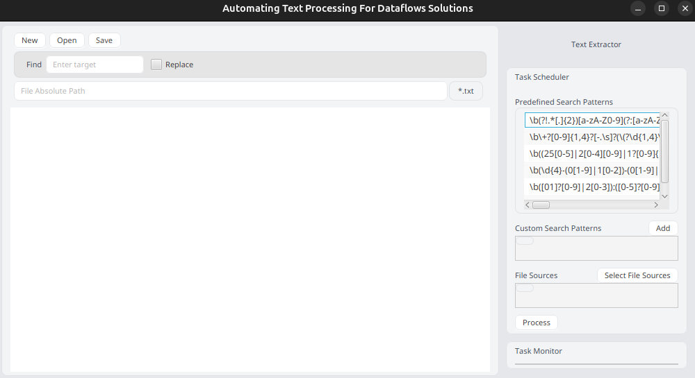

<p align="center">
  
</p>
<h3 align="center">AUTOMATING TEXT PROCESSING FOR DATAFLOW SOLUTIONS</h3>
<hr>

**Automating Text Processing for DataFlow Solutions** offers mini-version functionalities of a `Text Editor` like (`Search` & `Replace`, `Open Text File`, `Create Text File`). In addition, 
it offers functionalities to extract text from multiple sources and export results to a `Text` file.

---

## Live version
- [Project Instructions](https://amalitech-training.notion.site/Automating-Text-Processing-for-DataFlow-Solutions-1ca6c750c0d58183a3b6d7791e7742e4)
- [Video](https://docs.google.com/document/d/137GeTw1pxUcgnLl69X5xOhTrqx9cB7sFeitoxGwVStc/edit?usp=sharing)

## Built with


---

## Getting Started
To ge this program running on your local environment,
1. First, install `Java 17.+`
2. Install `Java FX` - `@latest`
3. Clone the repository ([link](https://github.com/sntakirutimana72/automating-text-processing-for-data-solutions))

## How does it work?
Application `entry point` is directly in main package
  ```Java
  package com.automating_text_processing;

  public class AutomatingTextProcessingApplication extends Application {}
  ```
1. **Editor**
- **Functionalities**
  - `Open` existing text files
  - `Overwrite` | `Update` existing files
  - `Create` new text files
  - `Find` & `Replace All`

2. **Extractor**
  - **Functionalities**
    - `Search` in multiple files & `Export` results as `TXT` file.
  - **Instructions:**
    - Select `search patterns` from the `Predefined` pool or **add** `custom search patterns`
    - Select `source` files to work with
    - Finally, hit `Process` to submit

### Screenshots


---
## Authors

👤 **Steve**
- GitHub: [@sntakirutimana72](https://github.com/sntakirutimana72/)

---

## 🤝 Contributing

Contributions, issues, and feature requests are welcome!

Feel free to check the [issues page](https://github.com/sntakirutimana72/EmployeeMIS/issues/)

---

## Show your support

Give a ⭐️ if you like this project!

---

## Acknowledgments

- Devs Communities for great free and resourceful articles.

---

## 📝 License

This project is [MIT](./LICENSE) licensed.
